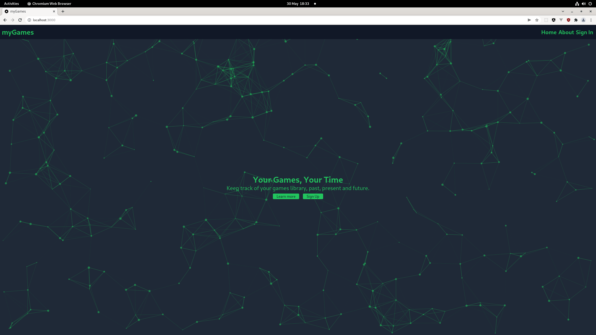
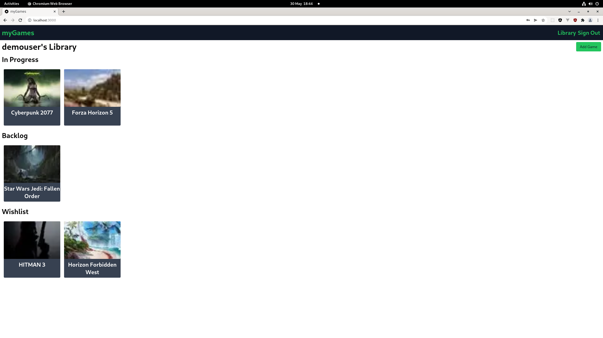
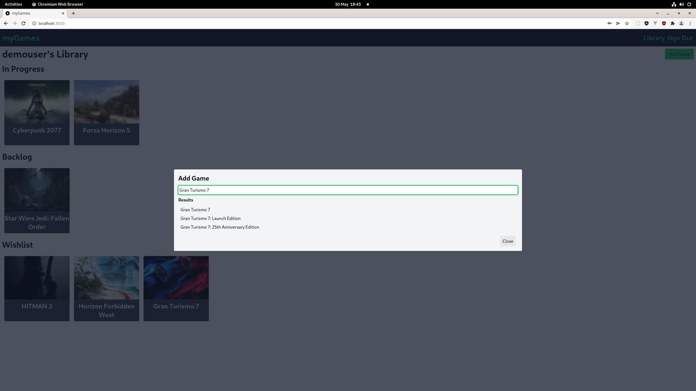
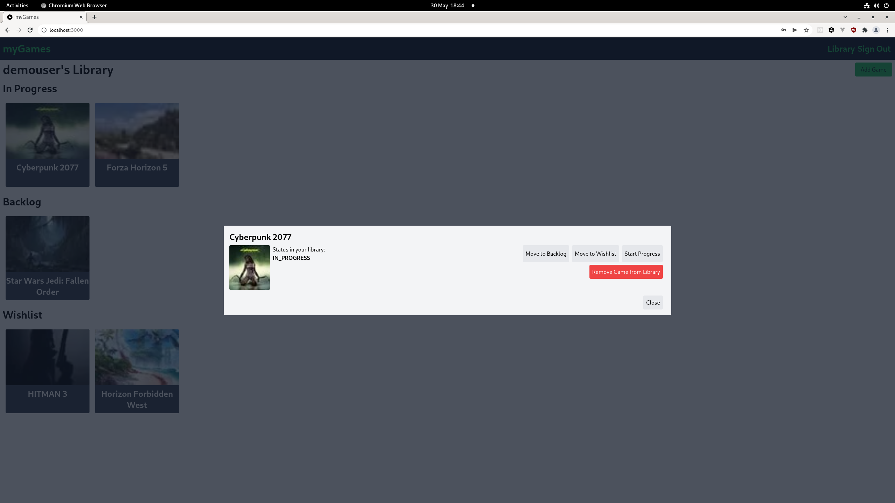

# myGames

## What is it?
A web application to keep track of your current games backlog and wishlist.

Written with React, Next JS and .NET Core

## Screenshots
Home Page

Users library

Adding a game to a users library.

Game status
